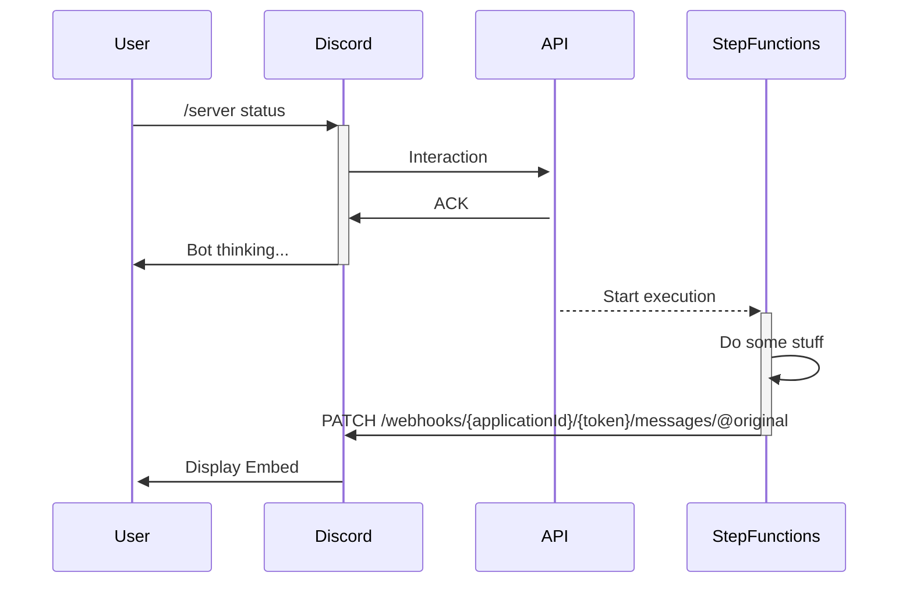

# Enshrouded AWS Hosting and Discord bot

## Getting Started

* Add a `./.env` file with your variables. TODO: Template
* Create the EC2 TODO: do it with CDK
* `npx cdk deploy`  deploy this stack to your default AWS account/region
* Register Discord bot with `bot.mydomain.com/discord`

## Workflow

